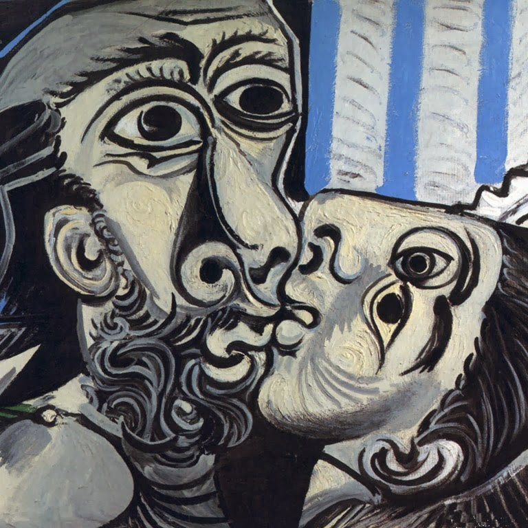

## 胡言乱语

参加工作以来，不明不白地加了很多人，微信从一年没几条消息到现在一天到晚震得脑袋嗡嗡响，我逐渐意识到人与人之间思维和价值的巨大鸿沟，意识到了旁人的混俗，更意识到了自己的麻木与精神贫瘠——那些（并不）努力学来的知识和珍贵的人生经历忘得一干二净，什么诗词文章、人文思考，以及千万条严丝合缝干净整洁的公式定理，如今都变成了重重迷雾。我变得一无所知，脑袋空空。曾因思考而深陷怀疑主义与虚无的痛苦，并没有因为放弃思考而有所减轻。“Each morning I get up I die a little”——我抱着这样一种心境迎来每个早晨，感受着时间如同千万吨汽轮般在浓雾中轰鸣而过，不可阻挡。我总是企图从对大人世界的拙劣模仿中缓解自己的焦虑不安——而我已经二十二三了，我本该是大人了。

逃离，逃离。从山南逃到水北，天涯逃到海角，当我不可避免地从消费主义从电子鸦片从邻国亚文化中醒来，我还能逃多久、逃到哪里去呢？如今我早已换回了七八年前的头像 “O beijo por Pablo Picasso”，我是否有勇气使用我心爱的久美子呢？

------

------

于2021年5月25日，武汉。

 

 

[[ 返回 ]](../navigation.md)
