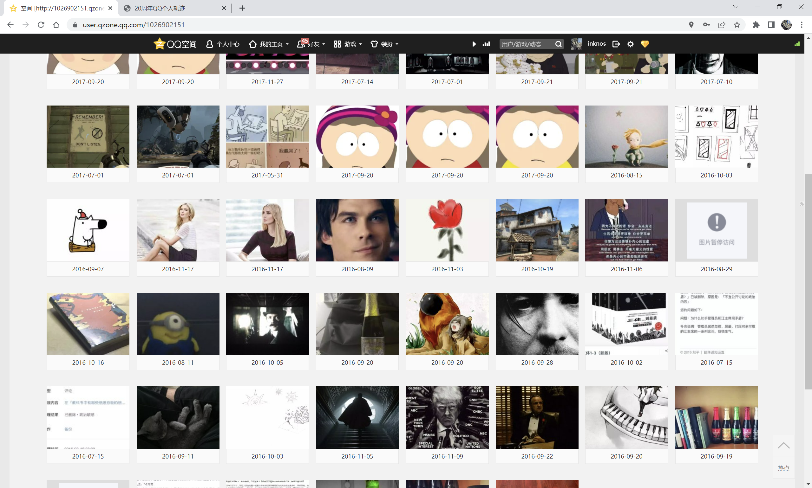
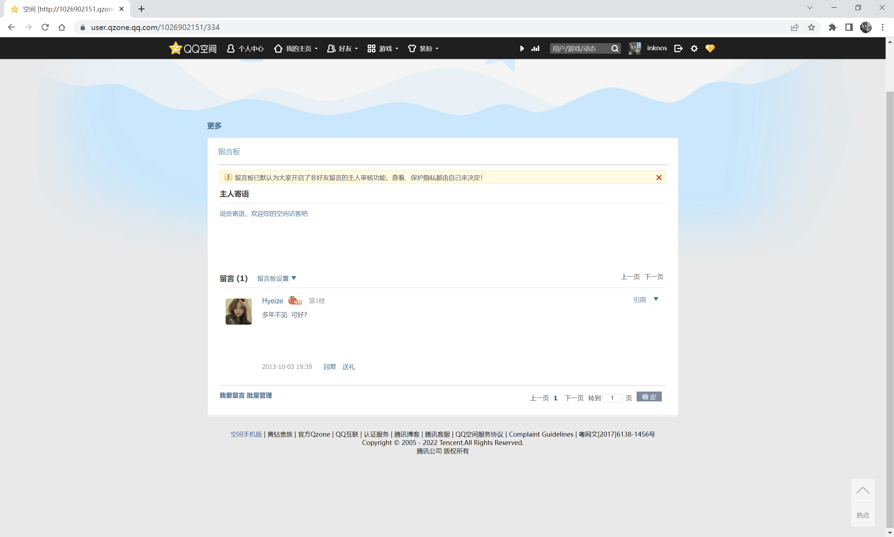

## 作古正经

心血来潮（什么都是心血来潮）逛了几天网页版的 QQ 空间。日志、留言板、空间装扮、签名档以及更多，这些也许十几年没有更新过前端代码的古老版块，正在唤醒我遥远的、上上个十年的宝贵回忆。

我的空间，像是一个声势浩大的古战场，如今却不剩多少痕迹。是在害怕杀马特和非主流的累累恶行重回世间，还是害怕看到不同年龄段各种不成熟的自己；是羞耻心作祟，还是想着人生重新出发…… 人生做了太多减法，那些羞耻又迷人的动态和日志，早已消失得无影无踪。这几天一直盯着空间发呆，脑海中慢慢只剩下一个想法：“过去与未来的对立” 这一激动人心的亘古母题，希望从今往后可以休矣。我不想做一个忘掉过去的人。

之前发现，声称90天保存期限的空间回收站有一个良性 BUG：那些删除了六七年甚至更久的照片，在我打开回收站的那天才开始90天倒计时，我仍有挽回的机会。可惜的是，在那个所谓 “之前” 的时候，我仍然在做减法。挑挑拣拣最后只恢复了142张照片，我把它们悉数保存在一个私密相册里，其余的照片大概永远也找不回来了。

永远是多远，这个问题压得我喘不过气来。近日翻阅相册，一股更大的遗憾涌上心头。我第一次发现，许多照片是备注了文字的，里面记录着我的各种电波和烦恼。我不禁去想，那些永久删除的照片里，还有多少碎碎念和未发完的疯，值得我去怀念。而它们已经消失了。

学过一点 SQL，我知道数据很少被直接删除。也许，在某个 `is_del` 字段为真值的一行记录里，我的那些疯言疯语，仍然静静地躺在服务器里，十几年来也偷吃过一两度电。也许，腾讯多发发慈悲，我也有机会再见它们一眼。但是动态里提到的人、相处过的人、仍在想念的人，大概真的无法再见了。

------

QQ 空间实在令人怀念，尤其是那十年如一日的、low 穿地心的审美。打开主页，侧边栏的一个显眼位置里，QQ 农场仍然在招徕游客。我抱着朝圣的心情点了进去，然后被告知没有安装 FLASH。所有的东西都在飞快老去，QQ 农场也好，FLASH 也罢，都成了时代的眼泪。我思来想去，最终还是没有下载所谓的 “微端”—— 它已不再是我记忆中的农场，坚持下去不知还有多少意义。

QQ 农场、QQ 牧场还有抢车位，这些都属于远古互联网的疯狂。小学流行过一段时间的偷菜，没过多久，这股奇怪风气蔓延到我妈那辈人身上。当年妈妈经营着全家人的农场牧场，几点收菜几点出栏事无巨细地写在纸上，然后凌晨三四点钟蹲点。那大概是个全民为偷菜而疯狂的时代，否则我怎么也想不明白蹲点的意义。既然我没有怎么偷菜，当年我到底在干什么？感觉自己忘记了真正很重要的事，我现在想起来了——

好友买卖。

我想起了自己倒卖好友导致其身价暴跌的累累恶行，我想起了我倒卖的那个女孩子，我想起了仍然被我好好保存着的、她写给我的情书，我想起了里面那句一生难忘的话：

> 我的生活很简单，只有你；我的生活很精彩，因为你。

然后我想起了中考前夕把那封情书藏在床垫下为自己加油打气的迷惑操作，我想起了外婆发现后取笑我的那份窘迫——我现在真想挖个坑把自己埋了；

我想起了我在高中的课前演讲中引用过这句话，我想起了那份演讲稿被一个很好的女孩子收藏了起来……

就此打住。

------

我回想起了小学毕业时写过的一篇关于她的日志。同学聚会那天，散场的时候，别人当着我的面向她一脸神秘地提起了那篇日志。那个没有智能手机的年代，我们只能比谁能更快回家摸到电脑，比到底是她看得快还是我删得快。然后我输了，她看到了那段羞耻不已的话，我把她比作生命中的一道彩虹……

我想起了我为什么会输：因为我妈在用电脑。我想起了妈妈有我的密码，我想起了妈妈对我的神秘一笑——

我妈说我写的好暧昧。

2022年6月30日凌晨1点46分，面红耳赤，坐立不安。我好想再看那篇日志一眼。

------

零几年的时候流行空间互踩，我的留言板里被人刷了好多火星文以及其它非主流文字。由于太过尴尬，高一的时候我把它们全删了，只剩下一句，失去联系的多年以后她加回我的 QQ 然后留的言。

可惜的是，不久后我因为发说说嘲笑韩流被她怒删了好友，然后再也没有了联系……

世界真奇妙，也许这就是生活吧。

------

依稀记得我的第一个 QQ 号，九位数，大概是296552213。昨天我发动亲友，看看能不能在好友列表里找到我以前的 QQ，如果号码没有记错，我想找个办法把它买回来做纪念。目前使用的 QQ 是2008年11月15日创建的，小学四年级，远比我想的要晚。也许很多和 QQ 有关的珍贵回忆，我投射错了对象。好怀念那个别人发886我看不懂，傻乎乎地继续打字的纯真年代啊，当年我八岁，应该是二年级。

------

于2022年6月30日，洛杉矶。

 

 

[[ 返回 ]](../../../../sites/proses/多余的话.md)
