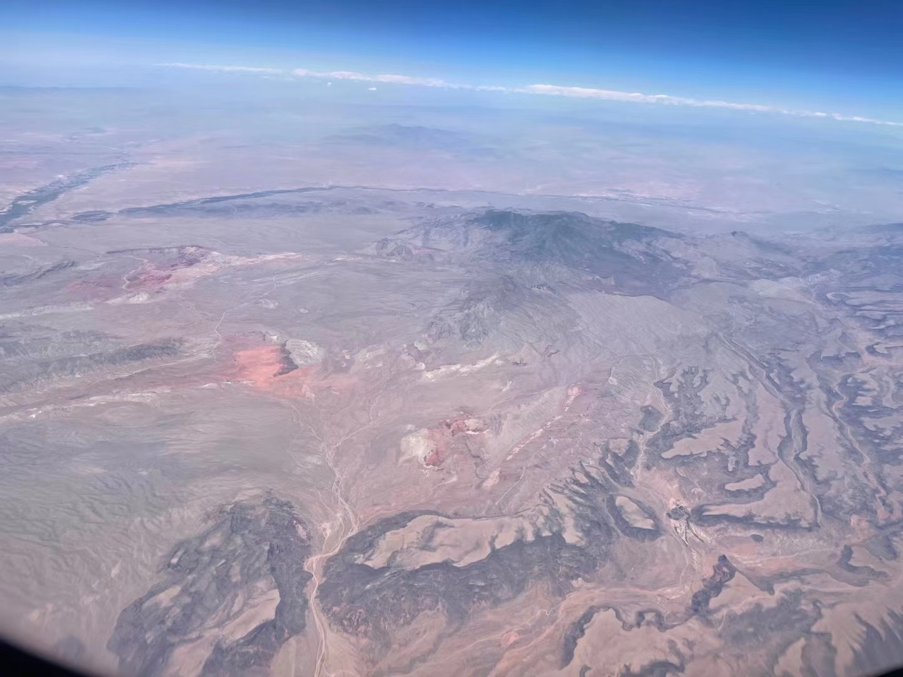

## 胡言乱语

不知道 SBR 大赛有没有经过内华达的荒漠，说起来，读过两遍的 SBR 到底在讲一个什么样的故事呢？

横穿美国的杰洛和乔尼，既没有拿到大赛的冠军，也没有夺回圣人遗体；杰洛死在了终点前，乔尼英年早逝，大总统的目的似乎悉数实现，这一切的意义在哪里呢？

如果这是一个歌颂勇气的故事，请也带给我一点接受意难平的勇气。

------

于2022年6月19日，内华达上空。

 

 

[[返回]](../../../../sites/小作文们/碎碎念.md)
